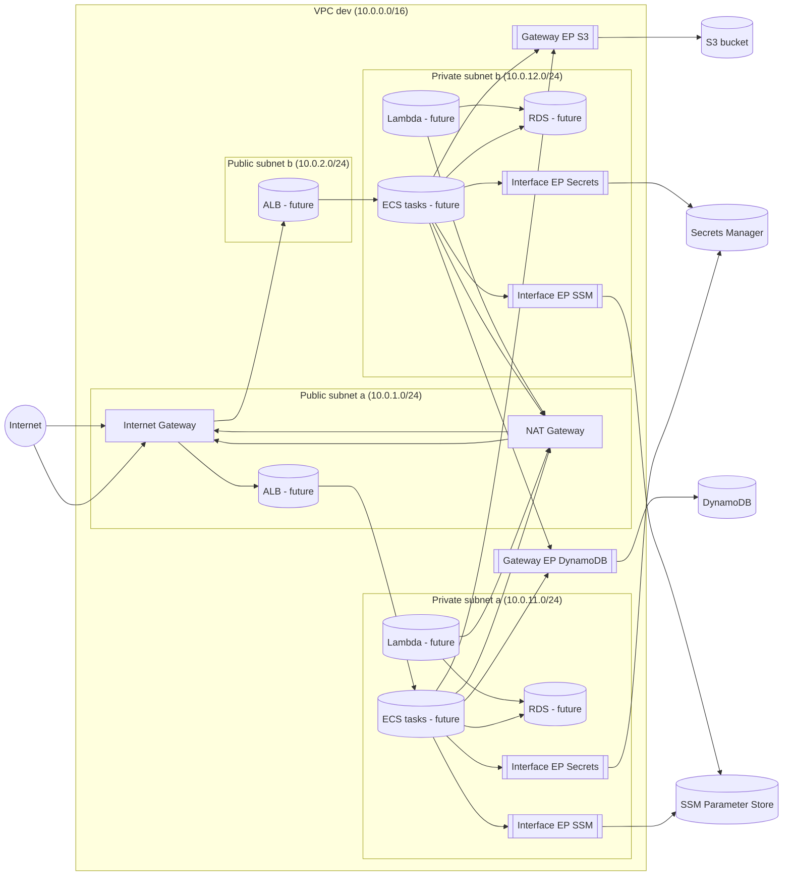

# Topologia sieci dev — big picture

## 1. Cel dokumentu

Ten dokument ma być **instrukcją obsługi sieci** dla projektu `OrderFlow AWS Lab` w środowisku `dev`:

- tak napisaną, żebyś **po miesiącu przerwy** mógł szybko odtworzyć w głowie:
  - jak wygląda topologia sieci,
  - którędy płynie ruch,
  - po co są poszczególne elementy,
  - jak to się ma do Twojego doświadczenia z **Azure**,
- bez konieczności grzebania w kodzie Terraform albo w kilku rozproszonych dokumentach.

Zakres:

- tylko to, co jest **zaprojektowane i zaimplementowane teraz**:
  - moduł `network-core` (VPC, subnety, IGW, NAT, route tables, Security Groups),
  - moduł `network-endpoints` (Gateway Endpoints, Interface Endpoints, VPC Flow Logs),
  - integracja w `envs/dev`.

Nie opisujemy tutaj jeszcze ALB/ECS/RDS/Lambd, ale w kilku miejscach zaznaczamy **gdzie będą podłączone**.

---

## 2. Big picture — jak patrzeć na naszą sieć

### 2.1 Co mamy „w pudełku”

W uproszczeniu, nasza sieć dev składa się z:

- **VPC dev** w regionie `eu-central-1`:
  - prywatna przestrzeń adresowa `10.0.0.0/16`.
- **Cztery subnety**:
  - `public-a` (`10.0.1.0/24`, AZ `eu-central-1a`) — publiczny, dla IGW/NAT/ALB,
  - `public-b` (`10.0.2.0/24`, AZ `eu-central-1b`) — publiczny, dla ALB,
  - `private-a` (`10.0.11.0/24`, AZ `eu-central-1a`) — prywatny, dla ECS/RDS/Lambda/endpointów,
  - `private-b` (`10.0.12.0/24`, AZ `eu-central-1b`) — prywatny, dla ECS/RDS/Lambda/endpointów.
- **Bramek i routingu**:
  - Internet Gateway (IGW) — wyjście z publicznych subnetów na Internet,
  - NAT Gateway (1 szt.) — wyjście z private do Internetu,
  - route table publiczna i prywatna, z odpowiednimi trasami.
- **Security Groups**:
  - `sg_alb` — dla Load Balancera (przyszłość),
  - `sg_app` — dla ECS/Lambda (aplikacje),
  - `sg_rds` — dla RDS (baza).
- **VPC Endpoints**:
  - Gateway: S3, DynamoDB,
  - Interface (PrivateLink): Secrets Manager, SSM Parameter Store,
  - z dedykowanym SG `sg_endpoints`.
- **VPC Flow Logs**:
  - logi przepływów sieciowych VPC do CloudWatch Logs.

### 2.2 Analogia do Azure (mentalny model)

Jeśli znasz dobrze Azure, możesz na to patrzeć tak:

- **VPC** ≈ **VNet**.
- **Subnets public/private** ≈ subnety w VNet z różnymi UDR/NSG.
- **Internet Gateway (IGW)** ≈ „domyślna brama do Internetu” + UDR z trasą `0.0.0.0/0 → Internet`.
- **NAT Gateway** ≈ **Azure NAT Gateway** podpięty do subnetu, przez który private wychodzi na Internet.
- **Security Groups (SG)** ≈ **Network Security Groups (NSG)**:
  - stateful firewall na poziomie ENI (karty sieciowej),
  - kontrola ingress/egress.
- **Gateway Endpoint (S3/DynamoDB)** ≈ **Azure Service Endpoint**:
  - routing do PaaS po prywatnej sieci, bez klasycznego Internetu,
  - brak własnego IP w Twoim subnecie.
- **Interface Endpoint (Secrets/SSM)** ≈ **Azure Private Endpoint**:
  - interfejs sieciowy (ENI/NIC) z prywatnym IP w Twoim subnecie,
  - DNS mapuje publiczny hostname usługi na to prywatne IP.
- **VPC Flow Logs** ≈ **NSG/VNet Flow Logs w Network Watcher + Log Analytics**.

Jeśli pamiętasz te odpowiedniki, łatwiej Ci będzie „przełożyć” wiedzę z Azure na AWS.

---

## 3. Schemat topologii sieci (big picture)

Poniżej schemat w notacji Mermaid; możesz go wkleić np. do edytora Markdown wspierającego Mermaid albo przekonwertować na PNG.

**Jak czytać ten schemat:**

- **Nie wszystkie ikonki są już fizycznie wdrożone** (ALB/ECS/RDS/Lambda to „future”), ale:
  - *sieć* (VPC, subnety, IGW, NAT, route tables) istnieje dzięki `network-core`,
  - *endpointy i Flow Logs* istnieją dzięki `network-endpoints`,
  - aplikacje po prostu „wstaną” w odpowiednich subnetach i SG.

---

## 4. Przepływ ruchu — krok po kroku

### 4.1 Ruch przychodzący (Internet → ALB → private subnets)

1. Klient z Internetu łączy się z publicznym DNS ALB (w przyszłości).
2. Ruch trafia przez **IGW** do subnetów publicznych:
   - ALB ma ENI w `public-a` i `public-b`.
3. ALB przekazuje ruch do zadań ECS/Lambd w subnetach **private**:
   - ruch **nie idzie z Internetu bezpośrednio do private**,
   - zawsze przechodzi przez ALB (warstwa L7).

**Azure analogia:**  
Application Gateway z publicznym IP w subnecie publicznym, routujący do backend poola w subnetach private.

### 4.2 Ruch wewnętrzny (ECS/Lambda → RDS, wewnątrz VPC)

1. ECS/Lambda ma ENI z prywatnym IP w `private-a/b`.
2. RDS ma prywatny endpoint w tych samych subnetach.
3. Ruch:
   - idzie **tylko wewnątrz VPC**, nie dotyka IGW/NAT,
   - jest kontrolowany przez SG:
     - `sg_app` (ECS/Lambda) ma egress do `sg_rds:5432`,
     - `sg_rds` ma ingress z `sg_app:5432`.

**Dlaczego tak:**  
Chcemy, żeby baza danych była **niewidoczna z Internetu**, a jedynym sposobem dostępu były warstwy aplikacyjne.

### 4.3 Ruch do usług AWS bez wychodzenia na Internet (Gateway / Interface Endpoints)

#### 4.3.1 ECS/Lambda → S3 / DynamoDB (Gateway Endpoints)

- Bez endpointów:
  - private → NAT → IGW → publiczny endpoint S3/DynamoDB.
- Z Gateway Endpoint:
  - private → **Gateway Endpoint w VPC** → S3/DynamoDB,
  - w route table private pojawia się trasa `prefix S3/DynamoDB → vpce-...`,
  - ruch nie przechodzi przez NAT ani przez IGW.

**Azure analogia:**  
Service Endpoint do Storage/Dynamo — ruch jest „oznaczany” jako pochodzący z Twojego VNetu i nie musi wychodzić klasycznym Internetem.

#### 4.3.2 ECS/Lambda → Secrets / SSM (Interface Endpoints)

- Interface Endpoint tworzy **ENI** w private subnetach:
  - ma własny SG (`sg_endpoints`),
  - ma prywatne IP w `10.0.11.0/24` i `10.0.12.0/24`.
- Włączony **Private DNS**:
  - `secretsmanager.eu-central-1.amazonaws.com` → prywatne IP endpointu,
  - aplikacja nic nie wie o endpointach — używa zwykłego DNS.
- SG:
  - `sg_app` → `sg_endpoints:443` (ingress w `sg_endpoints`),
  - egress z `sg_endpoints` na 443 do `0.0.0.0/0` (wewn. sieć AWS).

**Dlaczego osobny SG dla endpointów:**

- chcemy jasno oddzielić:
  - kto może **wejść** na endpoint (tylko ECS/Lambda, czyli `sg_app`),
  - dokąd endpoint może wysyłać ruch (tylko do usług AWS na 443),
- łatwiej to czytać i debugować niż dokładanie kolejnych reguł do `sg_app`.

**Azure analogia:**  
Private Endpoint do Key Vault/Config — NIC w Twoim subnecie, NSG na tym NICu, private DNS zone przekierowująca hosty.

### 4.4 Ruch na zewnątrz (private → Internet przez NAT)

Nie wszystkie usługi mają endpointy (np. zewnętrzne API, SQS/SNS na starcie).

- Ścieżka:
  - private → NAT Gateway w `public-a` → IGW → Internet/usługa,
  - kontrola przez SG `sg_app` (egress 80/443).
- Używamy NAT:
  - jako **fallback** dla wszystkiego, co jeszcze nie ma endpointu,
  - jako kanał do **zewnętrznych API**.

**Azure analogia:**  
VM/Pods w subnetach private wychodzą na Internet przez Azure NAT Gateway.

---

## 5. VPC Flow Logs — jak patrzeć na ruch

Flow Logs to „rejestr ruchu sieciowego”:

- loguje kto z kim rozmawia (źródło, cel, porty, protokół),
- loguje czy ruch był `ACCEPT` czy `REJECT`,
- w naszym projekcie:
  - logujemy na poziomie **VPC**,
  - wysyłamy do **CloudWatch Logs**,
  - domyślnie `traffic_type = "ACCEPT"` (wystarczające do normalnej pracy),
  - w razie problemów możemy tymczasowo przełączyć na `ALL`.

Po co:

- przy diagnozie:
  - czy ruch do S3 faktycznie idzie przez Gateway Endpoint, a nie przez NAT,
  - czy endpointy Secrets/SSM faktycznie przyjmują ruch (status ACCEPT),
  - czy coś nie jest blokowane przez SG/NACL.

**Azure analogia:**  
NSG Flow Logs / VNet Flow Logs w Network Watcher, z analizą w Log Analytics.

---

## 6. Gdzie to wszystko jest w Terraform

Bardzo wysokopoziomowo:

- `infra/terraform/modules/network-core/`:
  - fizyczna topologia: VPC, subnety, IGW, NAT, route tables, SG.
- `infra/terraform/modules/network-endpoints/`:
  - logika dostępu do usług AWS po prywatnym torze:
    - Gateway Endpoints (S3, DynamoDB),
    - Interface Endpoints (Secrets, SSM),
    - VPC Flow Logs.
- `infra/terraform/envs/dev/main.tf`:
  - składa wszystko w całość:
    - `module "network_core" { ... }`,
    - `module "network_endpoints" { ... }` zasilany outputami `network_core`.

Szczegółowa dokumentacja modulów jest w plikach:

- `docs/network/01-module-network-core.md`,
- `docs/network/02-module-network-endpoints.md`,
- a proces Terraform/IaC w `docs/network/03-terraform-network-iac.md`.

